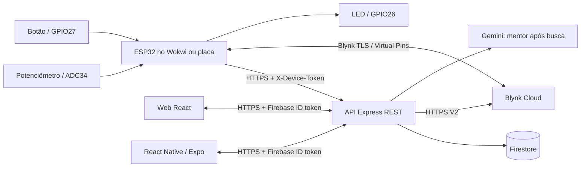

# Matriz de atendimento · Projeto Integrador

## Contexto

O Invista+ preserva o scanner fundamentalista de ações/FIIs e acrescenta um **terminal financeiro de interação**. O potenciômetro seleciona um nível de risco (0–100); o botão registra consultas; o LED recebe comandos. O perfil é uma lente de leitura educacional dos indicadores, não uma avaliação de suitability. As estatísticas analisam essas interações, não preços futuros de ativos.

## Requisitos e evidências

| Disciplina / requisito | Implementação | Como demonstrar |
|---|---|---|
| Web: linguagens e React | JavaScript, JSX, CSS, React/Vite em `web/` | Abrir dashboard e scanner |
| Web: API RESTful | Express, recursos `/api/v1/devices`, telemetria, estatísticas, atuadores e favoritos | GET/POST/PATCH/PUT, HTTP 201/202/4xx; testes de API |
| Web: OpenAPI | `docs/openapi.json` 3.0.3; Swagger UI `/api/docs` | `npm run docs:validate` e navegação na documentação |
| Web: banco | Firestore `iotDevices/{id}/telemetry/{session-sequence}` e `users/{uid}` | Ingerir leitura, reiniciar/abrir outro cliente e consultar histórico |
| IoT: dois sensores | Potenciômetro analógico GPIO34; botão digital GPIO27 | Girar potenciômetro e pressionar botão no Wokwi |
| IoT: atuador | LED GPIO26 com resistor 220 Ω | Switch na Web, no Expo ou no Blynk altera LED |
| IoT: protocolos/persistência | WiFi, HTTPS REST e Blynk com TLS; fila/reenvio/idempotência | Serial HTTP 201/200 e histórico persistido |
| IoT: Wokwi + Blynk | Circuito, firmware, Virtual Pins V0–V5 e guia em `firmware/` | Executar circuito autenticado e observar os mesmos estados |
| Estatística: média, moda e mediana | `shared/statistics.js`, tabelas Web e Mobile | Comparar série exportada CSV com cálculos conhecidos |
| Estatística: desvio, assimetria, curtose | Desvio amostral; Fisher e excesso de curtose corrigidos | Testes com série 1,2,3,4,5: média 3, s=√2,5, assimetria 0, excesso −1,2 |
| Estatística: probabilidades | Frequência de risco ≥67 e de intervalos com acionamento | Cards de probabilidade |
| Estatística: regressão e inferência | OLS risco × acionamentos/minuto; R²/r; Wilson 95% | Dispersão, reta, equação e intervalo |
| Mobile: consumir API/sensores | Firebase Auth, GET de dispositivos e leituras em `mobile/` | Mesma conta e dados da Web |
| Mobile: widget para atuador | React Native `Switch`, PUT do LED | Acionar e aguardar telemetria de confirmação |
| Mobile: processamento e gráficos | Cálculos locais compartilhados, SVG, distribuição | Trocar período e comparar indicadores |
| Versionamento | Git, branch, commits, PR e `.github/workflows/ci.yml` | Histórico e execução CI |

## Método estatístico

- Unidade: um intervalo de coleta. Variáveis: nível de risco inteiro; contagem de acionamentos; taxa normalizada para um minuto. Histogramas e probabilidades dão peso igual a cada **amostra**, não ao tempo total. Dados em intervalos diferentes são normalizados apenas na taxa.
- Desvio padrão amostral usa n−1. Fisher corrigido exige n≥3 e variância positiva; excesso de curtose corrigido exige n≥4 e variância positiva. Moda pode ser múltipla; sem repetição a série é amodal. `null` vira “—” em cálculos indefinidos.
- Regressão exige n≥3 e variância em x e y. O celular e a Web usam o mesmo módulo estatístico; a Web consulta os resultados do backend e o celular calcula sobre os dados recebidos.
- IC de Wilson 95% para proporção de amostras com risco ≥67. Autocorrelação temporal, perdas e seleção do período limitam a inferência. Nenhuma relação é apresentada como causalidade ou previsão financeira.
- Limite: 1.000 amostras mais recentes por janela na interface, com aviso explícito de truncamento. API oferece cursor estável por horário+ID. Datas `from/to` inclusivas, ISO 8601, janela de até 90 dias. CSV contém exatamente o conjunto exibido.
- `source` diferencia `wokwi`, `esp32` e `simulator`. A demonstração `demo` é somente local, não é ingerida pela API. Nunca apresentar uma série demonstrativa como medição física.

## Roteiro para a apresentação

1. Abrir `/api/docs`, mostrar esquema de autenticação e uma leitura de exemplo.
2. Entrar na Web e vincular o terminal com o código privado.
3. Iniciar Wokwi com Blynk conectado. Variar o potenciômetro em três faixas e apertar o botão várias vezes por alguns minutos.
4. Mostrar o histórico na Web e no Expo, na mesma conta. Exportar CSV e conferir os cálculos.
5. Acionar o LED em cada cliente. Mostrar comando V2 e confirmação V5/telemetria.
6. Desligar o simulador e observar “sem leitura recente” após 45 segundos. Reabrir a interface e comprovar que o histórico permanece.
7. Pesquisar PETR4/MXRF11, conferir os indicadores e abrir o Mentor no fim dos resultados.

A compilação e os testes automáticos estão separados da execução física. A evidência de comunicação Wokwi+Blynk exige credenciais de dispositivo válidas e uma sessão efetivamente executada; exportação Expo exige ainda teste em aparelho para comprovar a interação nativa.
